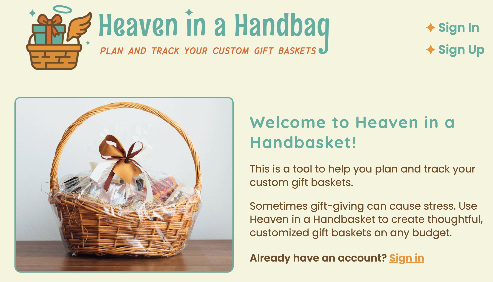
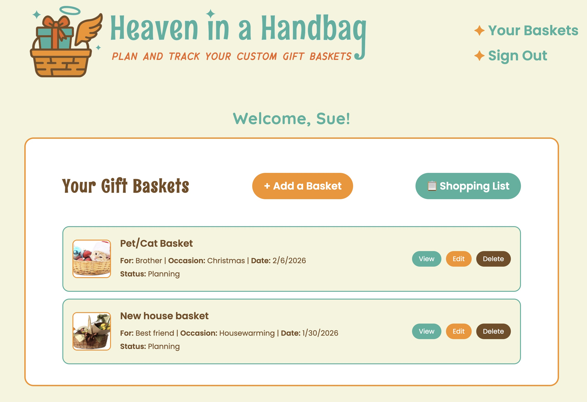
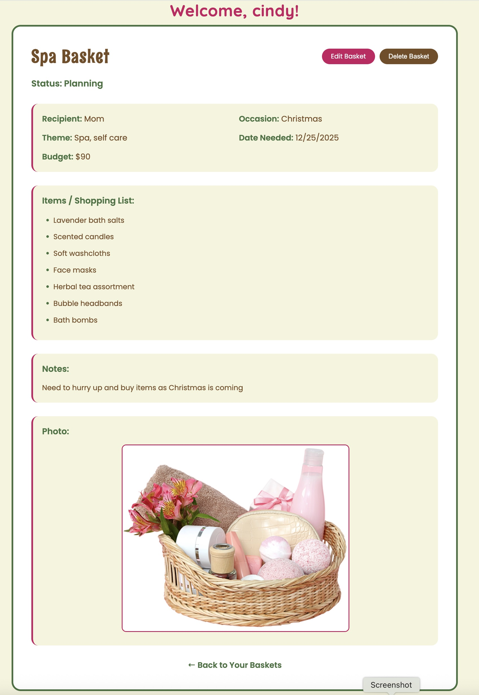
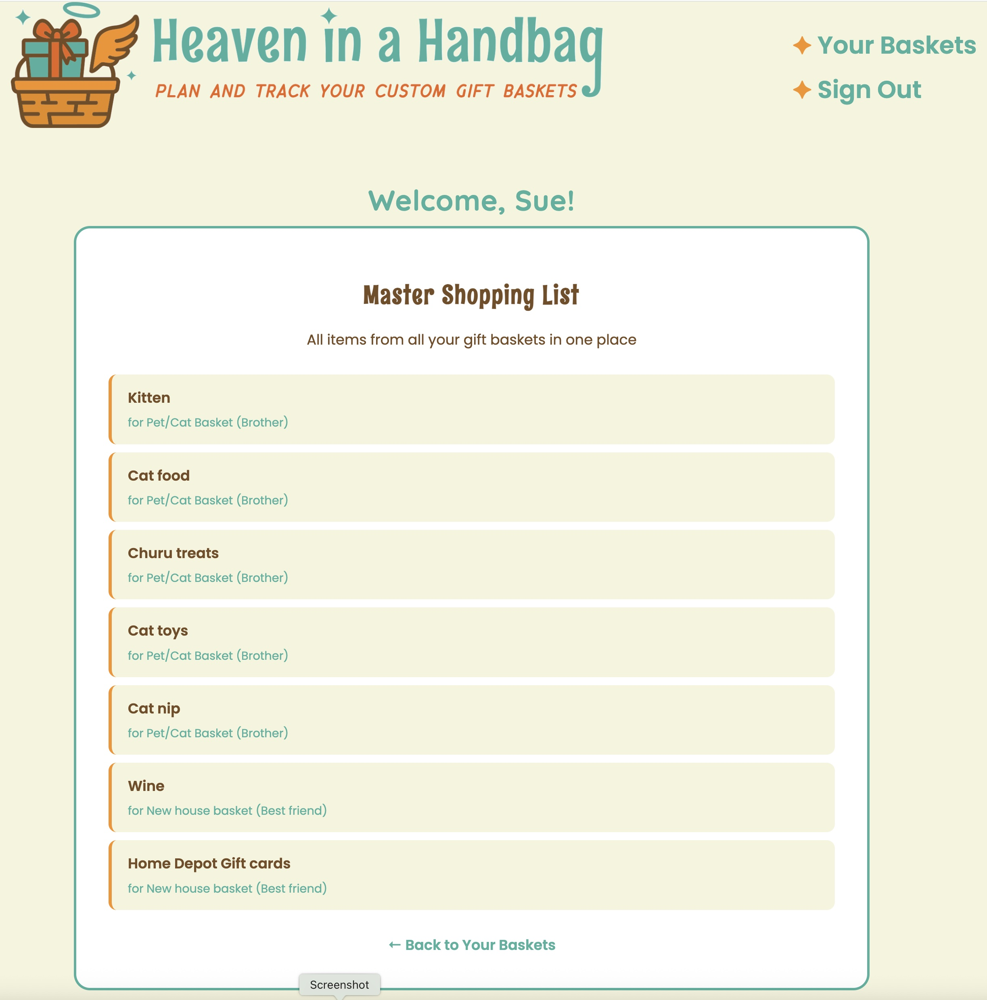

  

  # Heaven in a Handbasket

  ### [CLICK TO DEMO](https://heaven-in-a-handbasket-9dd625f0519b.herokuapp.com/)

  ##### Cindy S

  ## :gift: Description

  Heaven in a Handbasket is a gift basket planning and tracking application that helps users organize custom gift baskets for any occasion. Users can create detailed basket plans, track items needed, set budgets, and consolidate all shopping needs into one convenient master list. Whether planning for birthdays, holidays, or special events, this app keeps all your gift basket details organized in one place.

## :camera_flash: Screenshots 

  
Landing Page

  

  
Your Gift Baskets

  

  
Basket Details

  

  
Master Shopping List

  

## :computer: Technologies Used

## :sparkles: Key Features

- **Full CRUD Functionality** - Create, read, update, and delete gift basket plans
- **User Authentication** - Secure sign-up and login with session management
- **Occasion Templates** - Choose from 18+ preset occasions or create custom ones
- **Inspiration Photo Library** - 18 curated basket images to spark creativity
- **Recipient Tracking** - Track recipient name, age, and preferences
- **Budget Management** - Set and monitor basket budgets
- **Item Lists** - Organize shopping lists with easy line-by-line entry
- **Status Tracking** - Mark baskets as "Planning" or "Completed"
- **Master Shopping List** - Consolidate all items from all baskets into one convenient view *(Stretch Goal)*

## :fire: Getting Started

  
How to Create a Gift Basket

  
  1. Sign up for an account or sign in if you already have one
  2. Click "+ Add a Basket" from your dashboard
  3. Fill in basket details (name, recipient, occasion, date needed)
  4. Add items to your shopping list (one per line)
  5. Choose an optional inspiration photo
  6. Set your budget and add any notes
  7. Click "Create Basket" to save

  
How to Use the Master Shopping List

  
  1. Create multiple gift baskets with items
  2. Click "📋 Shopping List" button from your baskets page
  3. View all items from all baskets consolidated in one place
  4. Each item shows which basket and recipient it's for

  
Planning Resources

  
  **Trello Board:** [Project Planning & User Stories](https://trello.com/b/4qgUZN1G/project-2-heaven-in-a-handbasket-a-gift-track)
  
  **Deployed App:** [Heaven in a Handbasket](https://heaven-in-a-handbasket-9dd625f0519b.herokuapp.com/)

## :satellite: Future Enhancements

- [ ] **Shopping API integration** - Connect to Amazon or major retailers so users can search and save product links directly to their basket items
- [ ] **Checkboxes for purchased items** - Mark items as bought on the shopping list
- [ ] **Filter by status** - View only completed or in-progress baskets
- [ ] **Duplicate basket feature** - Clone baskets for similar occasions
- [ ] **Price tracking** - Calculate total cost as items are purchased
- [ ] **Archive feature** - Move old baskets to archive without deleting
- [ ] **Real file upload** - Upload custom photos instead of selecting from library

## :trophy: Acknowledgments

- Custom logo and branding designed in Adobe Illustrator
- Inspiration photos sourced from royalty-free stock sites
- Shopping List aggregation logic adapted from JavaScript array methods
- Embedded subdocument schema pattern from MongoDB documentation
- Built as Project 2 for General Assembly's Software Engineering Immersive
- MEN Stack architecture adapted from GA curriculum

---

**Copyright © 2025**

*Made with 🥤 and determination*